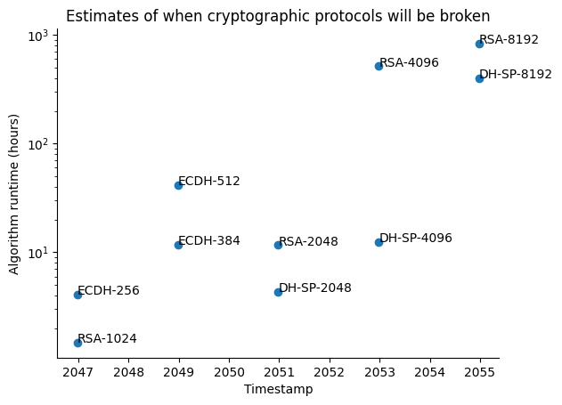
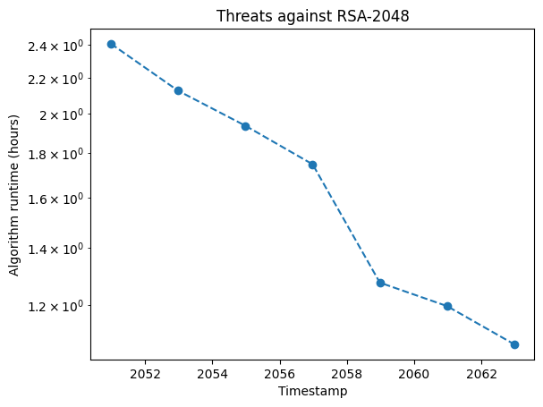

# Quantum Threat Tracker

A tool for quantifying the threat quantum computers pose to public-key cryptosystems. 

## Preliminary

The security of widely used public-key cryptographic protocols such the Rivest-Shamir-Adleman (RSA) and Diffie-Hellman (DH) protocols hinges on the assumption of computational hardness for primitive mathematical problems such as factoring integers and solving discrete logarithms. It is well known that Shor's algorithm will be able to solve these classically hard problems efficiently on a quantum computer, eventually rendering protocols such as RSA and DH insecure. The purpose of the Quantum Threat Tracker (QTT) is to create estimates as to when quantum computers will be powerful enough to break the aforementioned public-key cryptographic protocols.

## Documentation

See [QTT documentation](https://qec-codes.github.io/QuantumThreatTracker/).

## Installation

Packages in this repository are managed using [uv](https://docs.astral.sh/uv/). To use the QTT, clone the GitHub repository, then, inside the main repository folder, run `uv sync` to initialise the virtual environment.

## Examples

Here are some examples of the types of data the QTT is able to produce.

### Threat Timeline

The primary function of the QTT is to estimate when common public-key cryptographic protocols will be rendered insecure by quantum computers. The following is an example of such a timeline of threats presented in graphical form.

### Threat Over Time

As quantum computers improve over time, the threat they pose against cryptographic protocols will also evolve. Namely, the quantum algorithm runtime may decrease as parameters like gate times and error rates improve. The following is an example of how the threat against a specific protocol may change over time.

## Usage

Examples of how to use the QTT are located inside of the [notebooks](https://github.com/qec-codes/QuantumThreatTracker/tree/main/notebooks) folder.

## Contributing

The QTT is a proof of concept and is not currently open to contribution.

## Acknowledgements

Cambridge Consultants and the University of Edinburgh thank Ofgem for funding the development of the QTT.