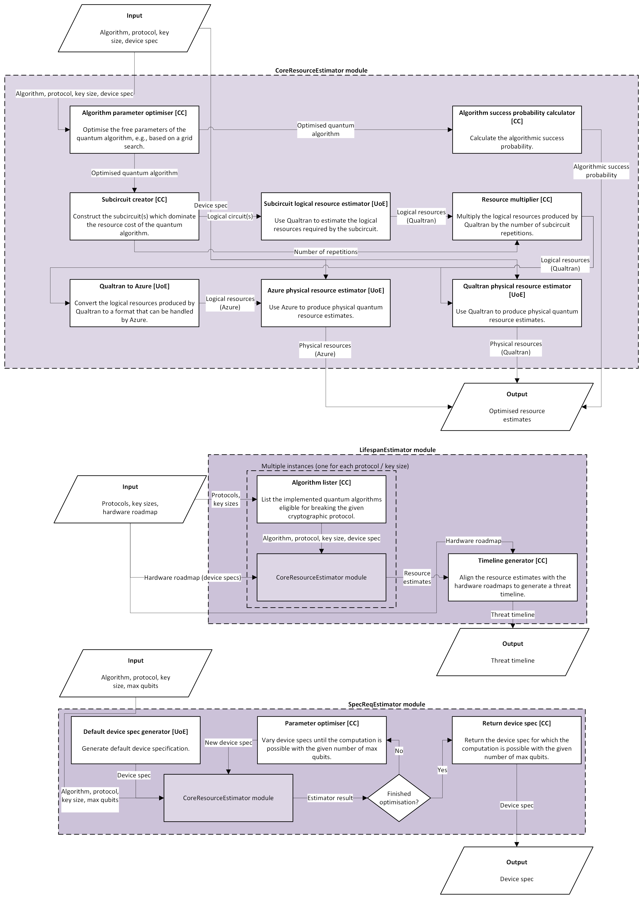

# Quantum Threat Tracker

## Introduction

The security of widely used public-key cryptographic protocols such the Rivest-Shamir-Adleman (RSA) and Diffie-Hellman (DH) protocols hinges on the assumption of computational hardness for primitive mathematical problems such as factoring integers and solving discrete logarithms. It is well known that Shor's algorithm will be able to solve these classically hard problems efficiently on a quantum computer, eventually rendering protocols such as RSA and DH insecure.

The purpose of the Quantum Threat Tracker (QTT) is to create estimates as to when quantum computers will be powerful enough to break the aforementioned public-key cryptographic protocols.

## Installation

Packages in this repository are managed using [uv](https://docs.astral.sh/uv/). To use the QTT, clone the GitHub repository, then, inside the main repository folder, run `uv sync` to initialise the virtual environment.

## Usage

Examples of how to use all core functionalities of the QTT are located inside of the [notebooks](https://github.com/qec-codes/QuantumThreatTracker/tree/main/notebooks) folder.

## Architecture Diagram

